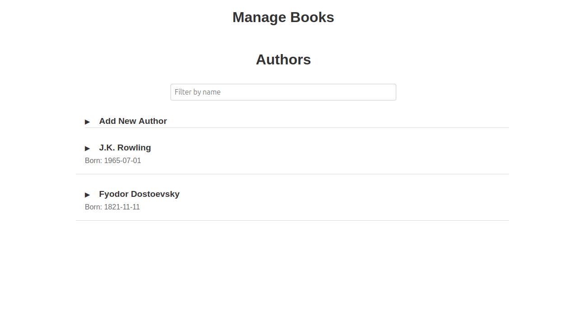
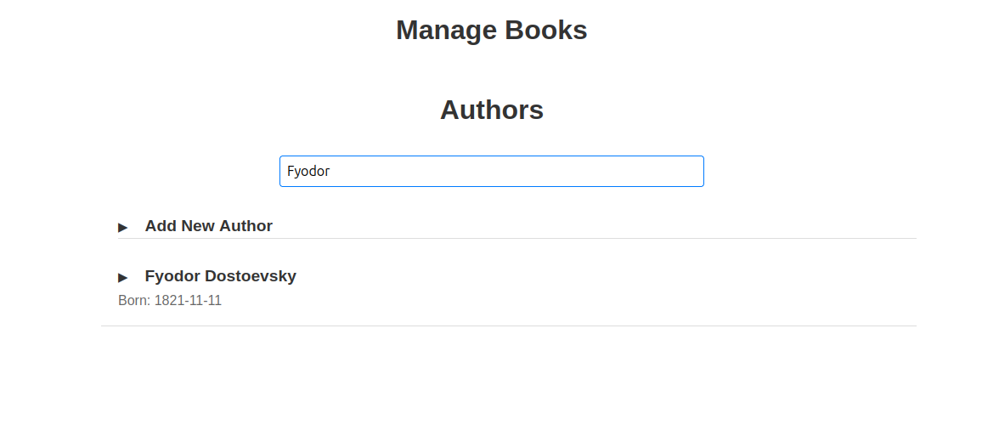
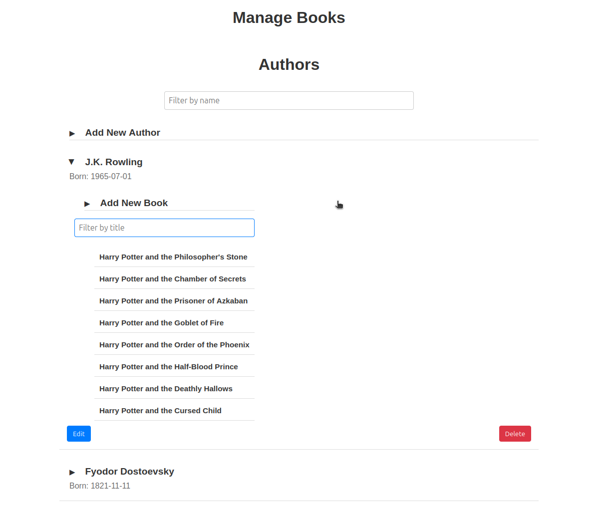
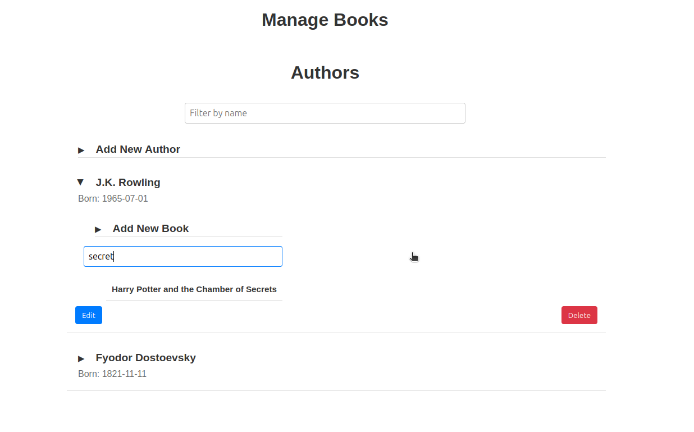
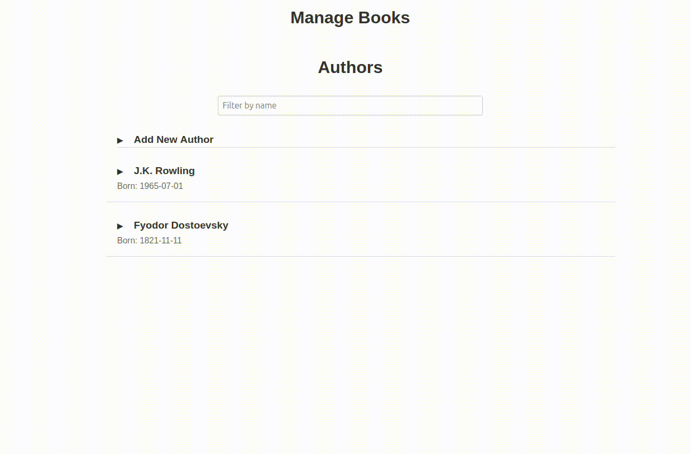
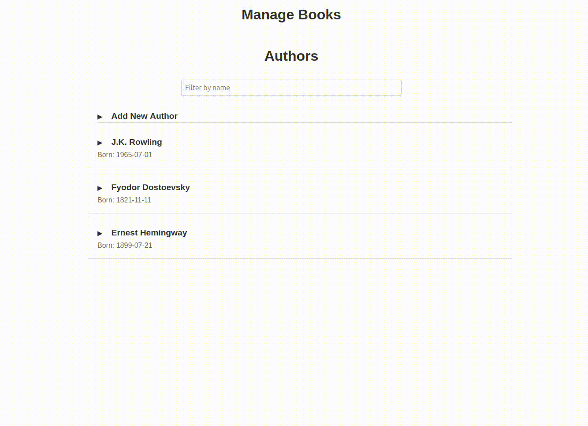
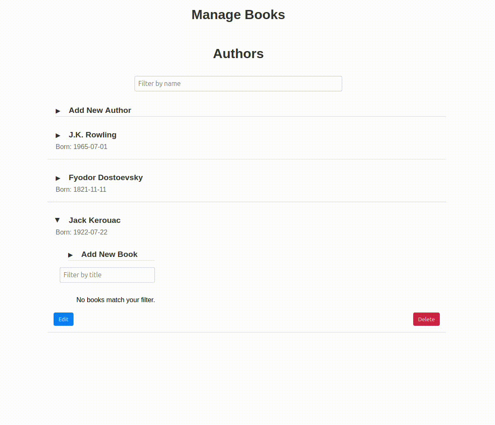

# Book Management Web Application

## Overview
This is a single-page web application built with React for managing a list of books. The application interacts with a REST API and provides functionalities for viewing, adding, editing, and deleting books. Users can also select authors from a list when adding or editing books.

## Features 
#### Main Page

#### Filtering Authors

#### View Books

#### Filtering Books

##### Adding author

#### Editing author

#### Deleting author 

#### Adding Book

#### Editing Book

#### Deleting Book

